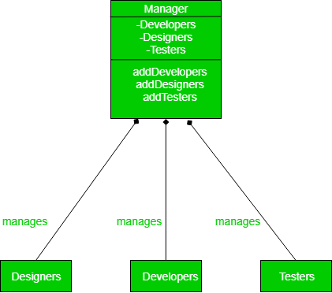
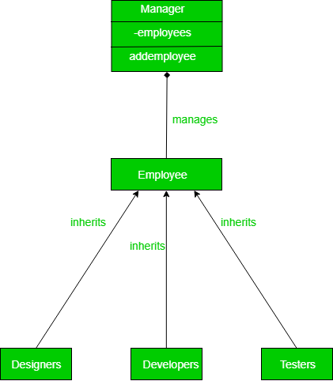

+++
title = "DIP (Dependency Inversion Principle)"
description = "DIP (Dependency Inversion Principle)"
chapter = true
weight = 5
pre = "<b>5. </b>"
+++

## DIP (Dependency Inversion Principle)
---

Dependency inversion talks about the coupling between the different classes or modules.

The main motto of the dependency inversion is Any higher classes should always depend upon the abstraction of the class rather than the detail.

This aims to reduce the coupling between the classes is achieved by introducing abstraction between the layer, thus doesn’t care about the real implementation.

#### The principle states:
- High-level modules should not depend on low-level modules. Both should depend on abstractions.
- Abstractions should not depend on details. Details should depend on abstractions.

---

Now let’s see how a naive design would look without any dependency inversion and what are the loopholes in that design:

The creation of the abstraction between different employees and Manager has resulted in very good looking design code which is easily maintainable and extendable:

---
#### Read More:
- https://github.com/SanderV1992/SOLID-examples/tree/master/src/dip/good
- https://www.geeksforgeeks.org/dependecy-inversion-principle-solid/
