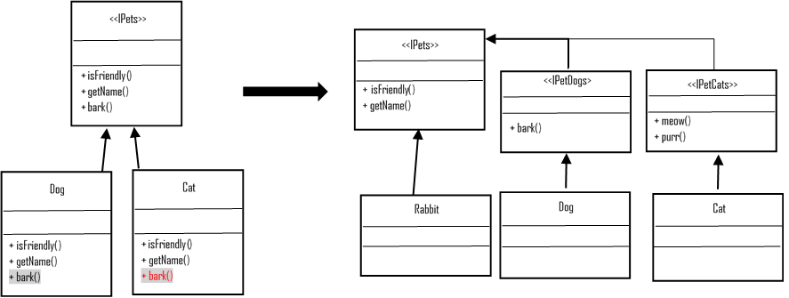

+++
title = "ISP (Interface segregation principle)"
description = "ISP (Interface segregation principle)"
chapter = true
weight = 4
pre = "<b>4. </b>"
+++

## ISP (Interface segregation principle)
---

following this principle helps the system stay flexible when making changes to the logic of work and suitable for refactoring.

---

No any client should be forced to depend on methods it does not use.

ISP splits interfaces that are very large into smaller and more specific ones so that clients will only have to know about the methods that are of interest to them.
Such shrunken interfaces are also called role interfaces. ISP is intended to keep a system decoupled and thus easier to refactor, change, and redeploy.

---
#### Read More:
- https://github.com/SanderV1992/SOLID-examples/tree/master/src/isp/good
