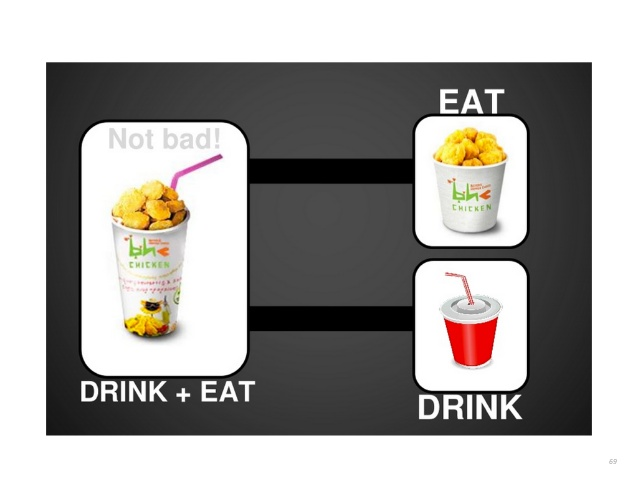

+++
title = "ISP (Interface segregation principle)"
description = "ISP (Interface segregation principle)"
chapter = true
weight = 4
pre = "<b>4. </b>"
+++

## ISP (Interface segregation principle)
---

следование этому принципу помогает системе оставаться гибкой при внесении изменений в логику работы и пригодной для рефакторинга.

Принцип разделения интерфейсов говорит о том, что слишком «толстые» интерфейсы необходимо разделять на более маленькие и специфические, чтобы программные сущности маленьких интерфейсов знали только о методах, которые необходимы им в работе.
В итоге, при изменении метода интерфейса не должны меняться программные сущности, которые этот метод не используют.

---
#### Read More:
- https://github.com/SanderV1992/SOLID-examples/tree/master/src/isp/good
