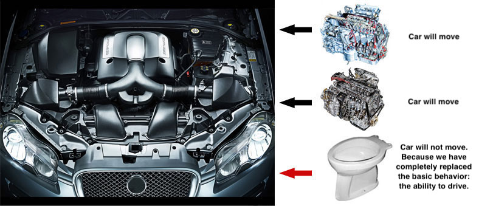

+++
title = "LSP (Liskov Substitution Principle)"
description = "LSP (Liskov Substitution Principle)"
chapter = true
weight = 3
pre = "<b>3. </b>"
+++

## LSP (Liskov Substitution Principle)
---

Liskov's notion of a behavioural subtype defines a notion of substitutability for objects; that is, if S is a subtype of T, then objects of type T in a program may be replaced with objects of type S without altering any of the desirable properties of that program (e.g. correctness).

---

#### The LSP principles are followed in the following cases:
- 
No new exceptions should be thrown by methods of the subtype, except where those exceptions are themselves subtypes of exceptions thrown by the methods of the supertype.
- does not violate the functionality
- returns the same type
- subclass object has a contract with a superclass

#### The LSP principle is violated in the following cases:
- the parent class in the method calls some kind of external service,
   and the child completely rewrites the method.

---
#### Read More:
- https://github.com/SanderV1992/SOLID-examples/tree/master/src/lsp/good
- https://dou.ua/lenta/articles/liskov-substitution-principle/
- <a href="https://ru.wikipedia.org/wiki/%D0%9F%D1%80%D0%B8%D0%BD%D1%86%D0%B8%D0%BF_%D0%BF%D0%BE%D0%B4%D1%81%D1%82%D0%B0%D0%BD%D0%BE%D0%B2%D0%BA%D0%B8_%D0%91%D0%B0%D1%80%D0%B1%D0%B0%D1%80%D1%8B_%D0%9B%D0%B8%D1%81%D0%BA%D0%BE%D0%B2">https://ru.wikipedia.org/</a>
