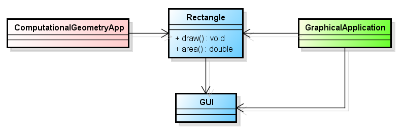
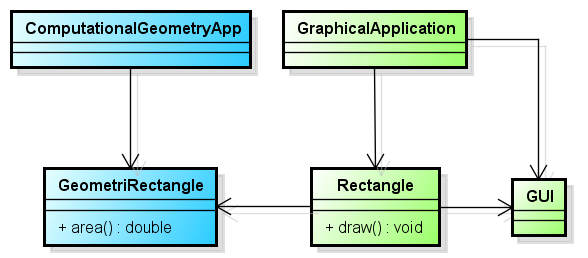

+++
title = "SRP (Single Responsibility Principle)"
description = "SRP (Single Responsibility Principle)"
chapter = true
weight = 1
pre = "<b>1. </b>"
+++

## SRP (Single Responsibility Principle)
---

Каждый объект должен иметь одну ответственность и эта ответственность должна быть полностью инкапсулирована в класс. Все его поведения должны быть направлены исключительно на обеспечение этой ответственности.

---

#### Принцип SRP можно применить только в том случае, когда:
- объекту класса становится позволительно слишком много

- любое изменение логики поведения объекта приводит к изменениям в других местах приложения, где это не подразумевалось изначально

- приходится тестировать, исправлять ошибки, даже если за их работоспособность отвечает третья сторона

- невозможно легко отделить и применить класс в другой сфере приложения, так как это потянет ненужные зависимости

---

#### Bad:

#### Good:

---
#### Read More:
- https://github.com/SanderV1992/SOLID-examples/tree/master/src/srp/good
- <a href="https://ru.wikipedia.org/wiki/%D0%9F%D1%80%D0%B8%D0%BD%D1%86%D0%B8%D0%BF_%D0%B5%D0%B4%D0%B8%D0%BD%D1%81%D1%82%D0%B2%D0%B5%D0%BD%D0%BD%D0%BE%D0%B9_%D0%BE%D1%82%D0%B2%D0%B5%D1%82%D1%81%D1%82%D0%B2%D0%B5%D0%BD%D0%BD%D0%BE%D1%81%D1%82%D0%B8">https://ru.wikipedia.org/</a>
